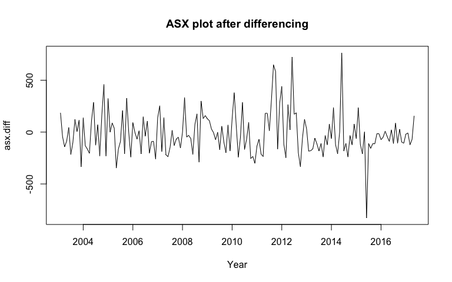

The current report is the summary of the ASX all ordinaries pride index from January 2003 to May 2017 in Australia share market.There are three aims for the current report. The first aim is to identify the sesonality of the data set. The second aims is to observe and analyse the trend and seasonal effct on all ordinaries price index. The last aim is to observe and analyse the accurate forecasts for five monts ahead by using this data set.  

The current data set contains 173 observation for the ASX all ordinaries pride index from January 2003 to May 2017 in Australia share market.


```r
library(easypackages)
libraries("Hmisc", "forecast", "expsmooth", "TSA", "dynlm", "x12", "car", "AER")
asx = read.csv("ASXdata.csv")
asx =  ts(asx$price, start = c(2003,1), frequency =12)
#Figure 1. Time series plot
plot(asx, type = 'o', xlab = 'Year', ylab='Price Index',
main = 'Time Series plot for ASX all ordinaries pride index')
points(y=asx, x=time(asx), pch=as.vector(season(asx)))
```


```r
par(mfrow=c(1,2))
Acf(asx, lag.max = 50, main = "ACF plot")
Pacf(asx, lag.max = 50, main = "PACF plot")
```


Based on the observation of the time series plot, it shows that there is considerabe variable in the ASX's price index. In addition, it shows that there is decreasing of trend in the series which can be observe from the begining until around 2011. After that, there is a huge increasing of ASX's price index and decrease graduately around 2013 to 2016. The existence of trend can also be observe in the ACF plot which shows that thre is graduatle decrease on the lags. Further more, the plot suggested that there is patterns of moving average and autoregression behaviour. In addition, there is a sign of intervention suggested in the series which can be observed betweem 2010 and 2012, where there is huge inflation of the series. However, there is no clear evidence of the evidence of seasonality.


```r
#transformation
lambda = BoxCox.lambda(asx)
lambda
```

```
## [1] 0.7270021
```

```r
BC.asx = ((asx^(lambda))-1)/lambda
plot(BC.asx, xlab = 'Year', ylab = 'Transform series', main = 'BoxCox tranform series plot')
```


```r
adf.test(BC.asx)
```

```
## 
## 	Augmented Dickey-Fuller Test
## 
## data:  BC.asx
## Dickey-Fuller = -2.1143, Lag order = 5, p-value = 0.5285
## alternative hypothesis: stationary
```

```r
PP.test(BC.asx, lshort = TRUE)
```

```
## 
## 	Phillips-Perron Unit Root Test
## 
## data:  BC.asx
## Dickey-Fuller = -1.7058, Truncation lag parameter = 4, p-value =
## 0.6991
```
To observe the stationarity of the dataset, a BoxCox tranformation is applied. It was suggested that the ideal lambda value for the transformation is 0.73. However, the transformation shows that the series does is not stationary. As it was observed in the plot, it was suggesting that there is no diffecence compared to the previous time series plot. The Dickey-Fuller test (Dickey-Fuller = -2.11, p = 0.53) suggested that the series is not stationary. The same result can also be observe in the Phillips-Perron Unit Root Test (Dickey-Fuller = -1.71, p = 0.70) which also suggested that the seires is not stationary.


```r
#Differencing
asx.diff = diff(asx)
plot(asx.diff, xlab = "Year", main = 'ASX plot after differencing')
```



```r
adf.test(asx.diff)
```

```
## 
## 	Augmented Dickey-Fuller Test
## 
## data:  asx.diff
## Dickey-Fuller = -4.7746, Lag order = 5, p-value = 0.01
## alternative hypothesis: stationary
```

```r
PP.test(asx.diff, lshort = TRUE)
```

```
## 
## 	Phillips-Perron Unit Root Test
## 
## data:  asx.diff
## Dickey-Fuller = -12.069, Truncation lag parameter = 4, p-value =
## 0.01
```

To make the series stationary, first differencing method was applied to the data set. The figure shows that the series become staionary after differencing compared to the previous plot. In addition, the Dickey-Fuller test (Dickey-Fuller =-4.77, p < 0.01) suggested that after the differencing the series is stationary. This was further confirm by the Phillips-Perron Unit Root Test(Dickey-Fuller = -12.07, p <.01).


```r
fit.x12.asx = x12(asx)
plot(fit.x12.asx, sa=TRUE, trend=TRUE)
```


To observe the trend and seasonal effect on the ASX price index, the X-12 decomposition is applied to the data set. As observed in the x-12 plot, it was suggested it was suggested that there is a strong trend effect compared to the seasonal effect. Furtheremore, it was observed that the seasonal factor does not influence the changes of the ASX price index over years. 
\newpage

```r
plotSeasFac(fit.x12.asx)
```


This can be observed in the seasoanl adjusted plot. The plot suggested that there is no clear evidence of the seasonal factors in the data set. It shows that there no repeating pattern across the months and the mean value and SI ratio are fluctuating.


```r
fit.asx = stl(asx, t.window = 15, s.window = 'periodic', robust = TRUE)
plot(fit.asx)
```


```r
monthplot(fit.asx, choice = "trend")
```


```r
fit.asx.trend = fit.asx$time.series[,"trend"]
asx.trend.adj = asx - fit.asx.trend
plot(asx.trend.adj)
points(y=asx.trend.adj, x=time(asx.trend.adj), pch=as.vector(season(asx.trend.adj)))
```


```r
plot(naive(asx.trend.adj))
```

<!-- -->

```r
forecasts = forecast(fit.asx, method = "naive", h=5)
forecasts
```

```
##          Point Forecast    Lo 80    Hi 80    Lo 95    Hi 95
## Jun 2017       2951.226 2696.626 3205.825 2561.849 3340.602
## Jul 2017       2874.439 2514.381 3234.497 2323.777 3425.101
## Aug 2017       2961.601 2520.621 3402.580 2287.180 3636.021
## Sep 2017       2847.123 2337.924 3356.323 2068.370 3625.877
## Oct 2017       2931.374 2362.072 3500.677 2060.701 3802.047
```

```r
plot(forecasts)
```

<!-- -->

```r
plot(fit.x12.asx, sa=TRUE, trend=TRUE, forecast=TRUE)
```

<!-- -->

The forecast of the series shows that there is not a huge variation of the series for the next five months. It shows a steady value around 2800 to 3000. 
